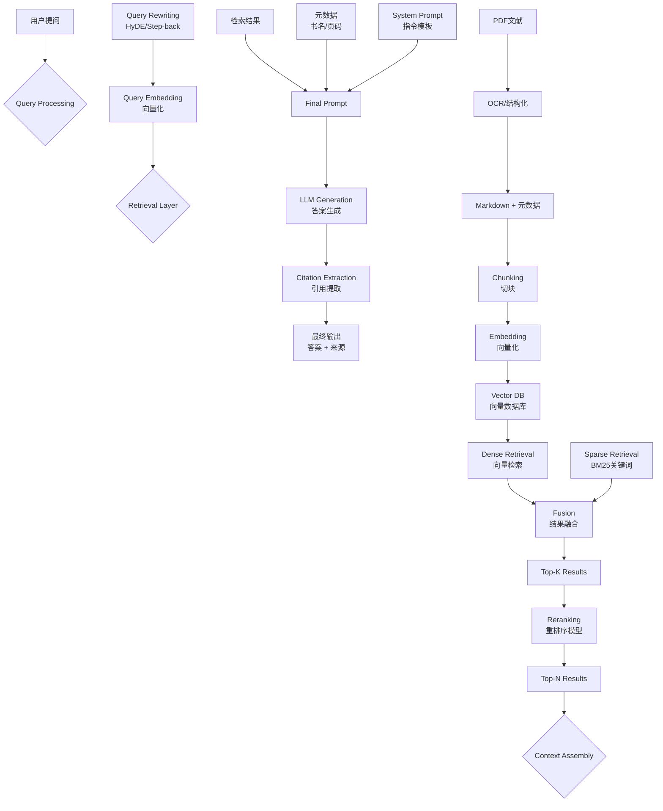

# 人文学科AI基础设施白皮书

---

## 一、使命定位

### 1.1 时代背景与目标愿景

当下，人工智能（AI）正从技术奇点走向人文深耕。文、史、哲学科承载着理解传统、激发思辨、引导社会精神的重责，但数字鸿沟与工具壁垒导致的人文学科AI应用体系混乱、重复开发、可复现性差，阻碍了知识的深度积累与传承。

本白皮书以未来10年至30年为架构周期，旨在奠定文史哲学科AI研究的基础设施规范，具有历史意义的奠基价值。我们既关注高度的工程可靠性和科学复现，也坚持人文学科的批判性与深度思考，把“技术手册”与“思想宣言”合二为一。

### 1.2 目标受众

- **专业研究者与在读学生**：涵盖文学、历史、哲学一线学者及研究生
- **技术新手的人文学者**：面向对AI好奇却技术背景薄弱的传统学者
- **数字人文/知识基础设施建设者**：关注科学数据治理、知识库与系统工程
- **关注AI伦理与人文未来的思想者**：引发更高阶反思

### 1.3 方法论的两极统一

- **工程复现**（可复用、可验证、可迁移）× **人文批判**（思想深度、历史反思、价值导向）
- **手把手工具标准** × **未来知识体系构筑**

---

## 二、技术原理：必须讲透的核心模块

### A. NLP基础架构：从Token到向量

#### 2.1 分词与数字化——Tokenization原理与流派

##### 2.1.1 Token的定义与中/英文分歧

- **Token ≠ 词**。Token是语言模型处理的最小单元，有时为单字，有时为字母片段、字符或子词。
    - 中文：单字最常见，1字≈1-2 tokens，复杂字词可能拆分/结合
    - 英文：常按subword或字符，4字符≈1 token
    - 词表（Vocabulary）：模型所能识别的全部token集合，一般5-10万（如BERT-base为30k，GPT-3为50k+）

##### 2.1.2 主流分词方式比较

|分词方案|原理|中文适用|英文适用|优势|劣势|适用模型|
|---|---|---|---|---|---|---|
|空格分词|按空格切分|×|√|快速，结构清晰|无法识别复合词|传统NLP|
|字符分词|单字符为token|√|√|最通用|粗糙，语义模糊|GPT、BPE|
|Subword/BPE|字母/字片组合递归合并|√|√|可泛化、兼容新词|粗分割难以控制|BERT, GPT家族|
|WordPiece|词/字片段自动聚合|√|√|减少OOV问题|特殊语言支持较差|BERT, RoBERTa等|
|SentencePiece|句级，基于统计|√|√|语言无关|粒度不均|XLNet, T5|
|拼音/偏旁分解|针对中文，子字拆解|√|×|语素捕捉|仅适用于中文|ERNIE, PinyinBERT|

##### 2.1.3 从原始文本到模型输入——整体流程

```text
文本输入: "康德的批判哲学"
→ 切分: ["康德", "的", "批判", "哲学"]
→ 查词表: ["康德":1024, "的":5, "批判":2048, "哲学":3096]
→ 词ID序列: [1024, 5, 2048, 3096]
→ 转Tensor: Tensor([1024, 5, 2048, 3096])
```

> 附注：常见BPE（Byte Pair Encoding）或WordPiece机制基于统计方法，将高频短序列合并为常用token，极大提升长文本处理能力和新词泛化。参见HuggingFace[官方分词器比较](https://huggingface.co/docs/transformers/tokenizer_summary)。

##### 2.1.4 分词方式与应用效果关系——学科实践须知

- **细粒度优先（Subword/BPE）**：可应对历史名词、古文本、外语混用
- **面向Markdown结构的chunk切分**：可保留章节逻辑（详见后文2.5）

---

#### 2.2 嵌入模型（Embedding Model）——让“语义”可比拟

##### 2.2.1 嵌入模型原理

- 每个**token**（或文本块）通过模型映射为**高维向量**（通常为768、1024、4096等维度）。
- 整个文本块一般使用[CLS]或[EOS]位的“池化”结果作为单一向量表达（Pooling）。
- 典型用途——**相似度检索**、**聚类分析**、**文本比对**

##### 2.2.2 语义相似度度量——Cosine Similarity

- 设文本A与B嵌入为向量**A**、**B**，
    
- 余弦相似度公式：
    
    [ cos(\theta) = \frac{A \cdot B}{|A||B|} ]
    
- 取值范围[-1, 1]，1表示方向完全一致（高度语义重复），0为完全无关，-1表示语义对立。
    
- 特点：衡量方向而非长度，适合文本“语义比较”。（参见[Milvus 快速解读](https://milvus.io/ai-quick-reference/what-is-cosine-similarity-and-why-is-it-used-in-semantic-search)）
    

##### 2.2.3 主流嵌入模型比较（2025年6月最新）

|模型|参数量|最大输入|向量维度|MTEB多语言分数|技术特色|
|---|---|---|---|---|---|
|BGE-M3|5.7亿|8192 tokens|1024|顶尖|Dense+Sparse混合（3合1）|
|Qwen3-Embedding-0.6B|0.6亿|32K|1024|强|灵活维度+指令感知，轻量化|
|Qwen3-Embedding-4B|4亿|32K|2560|强|多语言大规模适配|
|Qwen3-Embedding-8B|8亿|32K|4096|**70.58（No.1）**|超大输入+最佳多语义表现|
|Voyage-3-large|-|32K|1024|优|商业API支持|
|text-embedding-3-large|-|8191|3072|良|OpenAI官方，英文学术新贵|

> 注：**Qwen3 Embedding** 2025年取得突破，支持多尺寸模型（0.6B/4B/8B），最大输入32K tokens、灵活向量维度自定义（MRL），指令感知型任务适配，支持100+主流自然语言与数十种编程语言。详见[官方技术报告](https://arxiv.org/abs/2506.05176)、[Github](https://github.com/QwenLM/Qwen3-Embedding)。

##### 2.2.4 典型模型训练/使用管线（Qwen3-Embedding为例）

- **训练环节**：
    - 第一阶段：弱监督预训练（对比训练，大量无标注样本）
        - 采用生成式模型动态合成正负文本对，适配多任务/多语言
    - 第二阶段：高质量标注集监督微调
    - 第三阶段：多候选模型集成与合并，提升收敛与泛化力
- **推理环节**：
    1. 输入文本 → 分词（Tokenization）→ 转tensor
    2. 张量送入embedding模型，获得高维语义向量
    3. 可针对“检索、分类、聚类”等任务定制Pooling/编码方式

---

#### 2.3 BERT模型（Encoder）——“文本解剖刀”的学术作用

##### 2.3.1 结构-机制简述

- BERT及同类encoder模型采用**双向自注意力（Bidirectional Self-Attention）**机制
    - 不仅关注前文，也并行考虑后文
- 每个token在模型最后一层输出各自独立向量（[token_1] → v1, [token_2] → v2…）

##### 2.3.2 Encoder vs Embedding区别

||Embedding Model|Encoder Model（BERT等）|
|---|---|---|
|输出结构|文本整体单一向量|每个token独立向量|
|应用侧重|快速检索/聚类/语义对齐|精准抽取/结构化/高级理解|
|举例用途|相似段落找相近语料|命名实体识别、关系抽取|

##### 2.3.3 Attention机制核心（人文学科要点详解）

- **注意力本质**：输入序列每个token根据与其它token的相关性赋予权重，实现“远距离语义关联”和“上下文判断”（如“康德……批判”中token“批判”可关联远距离“康德”——超越传统局部视窗）
- **算例分析**：
    - 输入：“康德写了____批判”
    - 单向LLM只看“康德写了”，难以精确补全
    - BERT能同时通览前后文，判断唯一答案“纯粹理性”
- **工程影响**：移植到命名实体识别（NER）、关系抽取（RE）、情感分析等人文学科自动标注与结构化应用
- **最新人文研究进展**：针对历史文本命名实体识别，BERT等Transformer对变体拼写、文化专有名词表现持续改善（参见Ehrmann, 2023；Liu, 2021）

---

#### 2.4 大语言模型LLM（Decoder）——“智能生成引擎”

##### 2.4.1 原理——自回归预测与生成循环

1. **Tokenization**：“康德是” → [1024, 5]
2. **嵌入层查表**：token id → 向量
3. **多层Transformer （如96层）**，主打**因果自注意力（Causal Self-Attention）**方式——输出每步只看前文，不窥探未来
4. **Logits输出**：词表所有token生成概率（如“德国”25%，“著名”10%…）
5. **采样（Sampling）**：Temperature（温度系数）影响确定性/创造性
6. **Detokenization+循环**：拼接输出，作为新轮迭代输入

示意代码流程：

```text
Step 1: Tokenization "康德是" → [1024, 5]
Step 2: Embedding Lookup [1024, 5] → [[0.2, -0.1, ...], [0.5, 0.3, ...]]
Step 3: Transformer Layers (×96层)
Step 4: Logits（概率分布）
Step 5: Sampling，Temperature=0.1 → "德国"，Temperature=0.8 →“著名”
Step 6: Detokenization+反馈 →输出+下轮迭代
```

##### 2.4.2 推理模型（Reasoning Model）突破——2025年最新机制（以DeepSeek-R1为例）

- **突破点**：“Test-time Compute”——即推理环节主动生成（或自循环）思考Token
- **机制概述**：
    - 传统LLM直接生成答案
    - 推理模型（如DeepSeek-R1/OpenAI o1）在答案前先生成一串隐藏“思考token”，这些tokens不直接输出，而参与后续生成过程
- **表现优势**：在复杂学术问答、因果推理、多步推断等场景能力急剧提升（尤为适用于哲学式论证、历史链式因果分析）

##### 2.4.3 LLM与文史哲应用对比

|应用|Encoder（BERT类）|Decoder（LLM类）|
|---|---|---|
|信息抽取|强|弱|
|结构标注|精准|可辅助|
|复杂生成|无|首选|
|推理链|一般|推理型LLM更优|

---

#### 2.5 Chunk切分策略：从字符到结构语义

##### 2.5.1 Token/字符切分现状与局限

- **传统方式**：按定长（如2K、4K tokens）平滑切分
- **不足**：易切断自然段、上下文逻辑，破坏学科论据/引证完整性

##### 2.5.2 章节/结构/Markdown语义切分的优势

- **原理**：运用Markdown等结构语法，将内容按“# 一级标题”“## 二级标题”等自然主题或章节界定切块
- **优势**：
    - 保证每chunk为完整论断/段落，支持复杂溯源
    - 对Book/长文档可显著提升引用准确性
- **对比**：

|切分方式|优势|劣势|推荐场景|
|---|---|---|---|
|定长Token|兼容性好，工程易实现|容易句断，逻辑差|代码、对话片段|
|章节切分|语义完整、便于溯源|实现需依赖原文结构|专著、古籍、学术论文|
|Markdown结构|自动+灵活，标签溯引|需严格输入规范|跨文档类型的大知识库|

---

##### 【附流程图与表格将在专章B部分、附录细化】

---

### B. RAG系统：完整运行流程（科学化）

#### 2.6 RAG系统标准流程及关键模块

##### 2.6.1 系统运行全流程图

（下述Mermaid图形将以matplotlib流程图形式重现，后续用代码输出）



##### 2.6.2 关键创新技术详解

**a) 检索前置：Query Rewriting（查询重写）**

- **HyDE（Hypothetical Document Embedding）机制**：LLM先基于问题生成一段“假设答案文档”，将此文档嵌入后再进行检索。显著提升模糊/推理类问题的召回效果。
    - 参见HyDE在LangChain及[Medium解释](https://medium.com/@m.mastrodonato/hypothetical-document-embeddings-in-simple-words-and-with-examples-bc8b5c1c212a)。
- **Step-back Prompting**：将问题抽象/上溯一层，扩展检索覆盖面，防止遗漏。

**b) 混合检索：Hybrid Search + RRF**

- **BM25（稀疏检索）**：传统关键词/倒排结构，专名召回能力高
- **Dense Retrieval**：用向量空间的余弦相似度，捕捉同义/隐含逻辑
- **RRF（Reciprocal Rank Fusion）融合算法**：
    - 公式：score = Σ 1/(k + rank_i)  
        k常取60，rank_i为每方法独立排位
    - 优势：融合两类检索结果，兼容噪音、阶段性提升准确性
    - 详见Azure、OpenSearch等[官方资料](https://opensearch.org/blog/introducing-reciprocal-rank-fusion-hybrid-search/)

**c) 重排序（Reranking）机制**

- **动因**：初检结果范围大且泛，需精排Top-N提升质量
- **最新模型对比（2025）**：

|Model|Param|MTEB-R|CMTEB-R|MMTEB-R|MTEB-Code|
|---|---|---|---|---|---|
|Qwen3-Reranker-0.6B|0.6B|65.80|71.31|66.36|73.42|
|Qwen3-Reranker-4B|4B|**69.76**|75.94|72.74|81.20|
|Qwen3-Reranker-8B|8B|69.02|**77.45**|**72.94**|**81.22**|
|BGE-reranker-v2-m3|0.6B|57.03|72.16|58.36|41.38|
|Jina-multilingual...|0.3B|58.22|63.37|63.73|58.98|

- Qwen3的Reranker系列在多语种检索、代码等场景遥遥领先，Cross-encoder并编码query与doc，代价为算力开销显著提升（建议仅在混合检索/学术类场景启用，通用召回优先graph rag等高阶方案）。

**d) 切块、元数据与学术兼容策略**

- 推荐切块2048-4096 tokens，重叠区间256-512 tokens，支持章节结构/markdown语义切块
- 元数据建议用“底座注释`<!-- Page X -->` + markdown标签`<span id=...>`”，优化后续多平台兼容与引用

**e) 上下文组装与学术释引**

- 上下文拼装同时引入检索片段、关键元数据（书名、页码）、系统提示
- LLM生成答案后加“引用提取”，输出最终答复与精确来源

---

#### 2.7 参数调优与工程化指南

|参数|含义|推荐|影响|
|---|---|---|---|
|Chunk Size|切块大小|2048-4096 tokens|太小论证碎，大易噪声|
|Chunk Overlap|重叠区|256-512 tokens|防句断，上下文连续|
|Top-K|初筛数量|50-200|召回率|
|Top-N|精排后数量|10-30|精度与算力平衡，过高冗余|
|Similarity Threshold|相似度阈值|0.6-0.8|过滤低质|
|Temperature|生成温度|0.1-0.3（学术场景）|创造/确定性调控|

- 通用优化：混检优先保证召回+逻辑完整，精排建议适量运行、非全量重排序，兼顾时延与能耗。

---

#### 2.8 知识库与向量数据库选型对比（2025最新）

|数据库|性能|可扩展性|生态完善|优势|劣势|
|---|---|---|---|---|---|
|Milvus|极高|分布式|强|高并发、国产支持|环境依赖复杂|
|Qdrant|极高|云原生/分布式|强|Rust高性能、易维护|文档丰富度略逊|
|Chroma|高|单机/轻量|中强|AI原生、多语言好用|大规模性能略弱|
|Pinecone|超高|云服务|商业|超大数据量/服务托管|商业费用高|
|Weaviate|高|云原生|强|语义Web集成佳|社区中等|
|FAISS|高|单机/多卡|强|算法领先，本地优先|分布式弱|

---
### C. 文献数字化：从PDF到可追溯知识

人文学科的核心资产是**文献**——从古籍善本到现代学术专著，从手稿档案到期刊论文。将这些文献转化为机器可处理、人类可追溯的数字形态，是AI基础设施建设的第一块基石。

#### 1. Markdown的"中间态文明"地位

##### 1.1 为什么选择Markdown而非其他格式？

在数字人文领域，文档格式的选择绝非技术细节，而是关乎知识能否跨越时间、平台、工具而持续存活的根本问题。我们需要一种格式，它既能被人类直接阅读和编辑，又能被机器精确解析和处理；既能与版本控制系统无缝协作，又能在数十年后依然可读。

**主流格式深度对比**：

|维度|PDF|Word (DOCX)|XML/TEI|**Markdown**|
|---|---|---|---|---|
|**人类可读性**|✅ 视觉完美|✅ 所见即所得|❌ 标签繁杂|✅ 纯文本清晰|
|**机器可解析**|❌ 结构信息丢失|⚠️ 需专用库|✅ 精确结构|✅ 简单规则|
|**版本控制**|❌ 二进制文件|❌ ZIP压缩包|✅ 纯文本|✅ Git友好|
|**长期保存**|⚠️ 依赖渲染器|❌ 格式演化风险|✅ 标准化|✅ 纯文本永存|
|**编辑门槛**|❌ 需专业软件|⚠️ 需Office|⚠️ 需专业培训|✅ 任何文本编辑器|
|**转换灵活性**|❌ 单向输出|⚠️ 有限|✅ 标准接口|✅ 万能中间态|
|**元数据支持**|⚠️ 有限|⚠️ 内嵌复杂|✅ 原生支持|✅ YAML头+注释|

**为什么PDF不适合作为知识库底层格式？**

PDF（Portable Document Format）的设计目标是"视觉保真"——确保文档在任何设备上看起来完全一样。这种设计哲学导致了几个根本性问题：

1. **语义信息丧失**：PDF存储的是"如何绘制这个页面"，而非"这段文字的含义是什么"。一个标题和正文在PDF内部可能只是字号不同的文本块，没有结构层级信息。
    
2. **文本流断裂**：多栏排版、脚注、边注在PDF中可能被切割成无法重组的碎片。试图从一本康德《纯粹理性批判》的PDF中提取连续文本，往往会得到混乱的结果。
    
3. **不可追溯的修改**：PDF没有原生的版本历史概念。当你发现一处OCR错误并修正时，这个修改无法被追踪。
    

**为什么TEI/XML虽好但难以普及？**

TEI（Text Encoding Initiative）是数字人文领域的学术标准，它提供了极其精细的标注能力——你可以标记一个词是人名、地名、书名，可以记录不同版本的异文，可以嵌入复杂的批注系统。

但TEI的问题在于：

- **学习曲线陡峭**：完整的TEI规范有500多个元素，需要专业培训
- **编辑成本高昂**：没有友好的所见即所得编辑器
- **协作门槛**：非技术背景的学者难以参与

**Markdown的独特价值：足够好的平衡**

Markdown的设计哲学是"为写作者而非排版者服务"。它用最简单的符号（`#`、`*`、`>`、`[]`）捕捉最核心的文档结构，达成了一种罕见的平衡：

```
markdown
# 第一章 先验感性论        ← 章级标题
## 第一节 论空间           ← 节级标题

康德在此提出了著名的论证[^1]：

> "空间不是从外部经验中抽象出来的经验概念。"[^2]
>                          ← 引用块（区分引文与评论）

这一论证的核心在于...

[^1]: 参见《纯粹理性批判》A23/B37-38。
[^2]: 原文："Der Raum ist kein empirischer Begriff..."

<!-- Page 42 -->       ← 页码锚点（可追溯性核心！）
```

这种格式的优势在于：

- **5分钟学会基本语法**：任何学者都能立即上手
- **纯文本存储**：用Git管理，每次修改都有迹可循
- **万能转换**：通过Pandoc可转为PDF、Word、HTML、LaTeX、TEI...
- **AI友好**：LLM可以直接处理，无需复杂解析

##### 1.2 Markdown保留的关键语义结构

在设计人文学科知识库时，我们需要Markdown承载以下核心语义：

###### 层级结构（Hierarchy）：

```markdown
# 一级标题：书/卷
## 二级标题：章
### 三级标题：节
#### 四级标题：小节
```

**引用与评论的区分**：

```markdown
柏拉图在《理想国》中写道：

> "正义就是做自己的事，不干涉他人的事。"

这一定义看似简单，但蕴含着深刻的分工理论...
```

**学术脚注**：

```markdown
黑格尔的辩证法并非简单的"正-反-合"[^thesis]。

[^thesis]: 这个流行的三段式表述实际上来自费希特，
而非黑格尔本人。参见Gustav E. Mueller, "The Hegel Legend 
of 'Thesis-Antithesis-Synthesis'", Journal of the History 
of Ideas, 1958.
```

**页码锚点**（这是人文学科的特殊需求）：

```markdown
<!-- Page 123 -->
先验统觉的统一性是经验可能性的最高条件...

<!-- Page 124 -->
...这种统一性不能从经验中派生。
```

---

#### 2. 页码锚点：学术伦理的技术具象

##### 2.1 为什么页码如此重要？

在人文学科中，"出处"（provenance）不是可选项，而是学术合法性的根基。当我们说"康德认为..."，读者有权追问：

- 这句话出自哪本书？
- 哪个版本？（A版还是B版？）
- 哪一页？
- 原文是什么？

失去页码，就失去了可验证性；失去可验证性，就失去了学术性。这不是技术问题，而是伦理问题。

在AI时代，这一要求变得更加紧迫。当RAG系统从知识库中检索信息并生成回答时，如果无法追溯到原始页码，用户就无法区分AI是在"引用"还是在"编造"。**页码锚点是对抗AI幻觉的第一道防线**。

##### 2.2 页码锚点的设计规范

**基础格式**：

```markdown
<!-- Page 123 -->
正文内容跨越多页时，在换页处插入新锚点...

<!-- Page 124 -->
...继续的内容。注意锚点放在新页内容开始之前。
```

**处理复杂情况**：

```markdown
<!-- 情况1：脚注跨页 -->
<!-- Page 45 -->
柏拉图的理念论[^1]在后世引发了持续争论。

<!-- Page 46 -->
亚里士多德首先提出了"第三人论证"...

[^1]: <!-- FootnoteRef: Page 45, continues to 46 -->
完整的理念论参见《理想国》第五至第七卷...


<!-- 情况2：A/B版双重页码（康德研究常见） -->
<!-- Page A23/B37 -->
"空间不是从外部经验中抽象出来的经验概念。"


<!-- 情况3：古籍的传统页码标注（如线装书） -->
<!-- Page 卷三·第十七葉·正面 -->
孔子曰："學而時習之，不亦說乎？"
```

##### 2.3 元数据JSON Schema：完整规范

每个文本块（chunk）都应携带结构化的元数据，以支持精确检索和引用生成：

```json
{
  "chunk_id": "kant_krv_chunk_047",
  "content": "先验统觉是经验可能性的最高条件...",
  "content_hash": "sha256:a1b2c3d4...",
  
  "source": {
    "file_path": "kant_1787_KrV_B.pdf",
    "file_hash": "sha256:e5f6g7h8...",
    "ocr_tool": "Marker-v1.4.0",
    "ocr_date": "2025-06-15T10:30:00Z"
  },
  
  "bibliographic": {
    "title": "Kritik der reinen Vernunft",
    "title_zh": "纯粹理性批判",
    "author": "Immanuel Kant",
    "year": 1787,
    "edition": "B版（第二版）",
    "publisher": "Johann Friedrich Hartknoch",
    "place": "Riga",
    "language": "de",
    "isbn": null,
    "doi": null
  },
  
  "location": {
    "start_page": 132,
    "end_page": 133,
    "page_label": "B132-B133",
    "volume": null,
    "chapter": "第二卷 先验分析论",
    "section": "第一篇 概念分析论",
    "subsection": "第二章 范畴的先验演绎（B版）"
  },
  
  "processing": {
    "chunk_method": "semantic_section",
    "chunk_size_tokens": 2048,
    "chunk_overlap_tokens": 256,
    "embedding_model": "Qwen3-Embedding-8B",
    "embedding_dim": 4096,
    "embedding_date": "2025-06-15T11:00:00Z"
  },
  
  "quality": {
    "ocr_confidence": 0.97,
    "human_verified": true,
    "verified_by": "reviewer_001",
    "verified_date": "2025-06-16T09:00:00Z",
    "known_issues": []
  }
}
```

##### 2.4 双层标注策略：底座与表示层分离

为了兼容不同的输出场景，我们推荐"底座注释 + 可编译表示层"的双层策略：

**底座层（存储层）**：使用HTML注释，不影响渲染

```markdown
<!-- Page 123 -->
<!-- Section: 2.3.1 -->
正文内容...
```

**表示层（输出层）**：根据目标格式编译

_输出为HTML时_：

```html
<p id="page-123" data-section="2.3.1">正文内容...</p>
```

_输出为LaTeX时_：

```latex
\marginpar{p.123}
正文内容...
```

_输出为学术引用时_：

```
（康德，1787，B132）
```

这种分离确保了源文件的清洁性，同时保留了完整的追溯能力。

---

#### 3. OCR技术演进与最佳实践

##### 3.1 三代技术的范式转移

OCR（Optical Character Recognition，光学字符识别）技术已经历三次重大范式转移，每一代都基于不同的技术假设：

**第一代：基于规则的字符识别（1990s-2010s）**

代表工具：Tesseract、PaddleOCR（早期版本）、ABBYY FineReader

核心原理：

1. 图像预处理（二值化、倾斜校正、噪声去除）
2. 版面分析（切割出文本行、单词、字符）
3. 字符匹配（将字符图像与模板库比对）
4. 后处理（拼写检查、语言模型校正）

```
图像 → 预处理 → 切割 → 字符识别 → 后处理 → 文本
```

**优势**：

- 速度极快（可处理数万页/小时）
- 可更换语言包，支持上百种语言
- 资源消耗低，可在普通CPU上运行
- 对高质量印刷品识别率可达99%+

**局限**：

- 不理解文档结构（标题、正文、脚注混为一谈）
- 对复杂版面（多栏、表格、图文混排）处理差
- 对低质量扫描件（模糊、污损、倾斜）鲁棒性差
- 完全不理解内容语义

**第二代：深度学习版面分析（2018-2023）**

代表工具：Marker、Docling、Layout Parser、PP-Structure

核心原理：

1. 视觉模型（如YOLO、Faster R-CNN）检测版面元素
2. 分类器识别元素类型（标题、正文、表格、图片、公式...）
3. 序列模型（如CRNN、Transformer）识别文本
4. 结构重建（按阅读顺序组织输出）

```
图像 → 版面检测 → 元素分类 → OCR识别 → 结构重建 → 结构化文本
```

**技术突破**：

- **Marker**（2024-2025）：DataLab开发的开源工具，专注于学术文档。支持84种语言的OCR，对公式识别（转LaTeX）表现优异。能输出Markdown、JSON、HTML等多种格式，自动处理页眉页脚、脚注、参考文献。2025年版本支持PDF、图片、PPTX、DOCX、XLSX、HTML、EPUB等多种输入格式。
    
- **Docling**（2024-2025）：IBM开发的开源文档解析框架，正在成为Python社区的事实标准。采用模块化架构，可组合专用模型（如TableFormer处理表格、公式识别器处理数学内容）。对商业报告、技术文档的表格识别尤为出色。最新版本整合了IBM Granite-Docling模型，实现端到端文档理解。
    

**优势**：

- 保留文档结构（标题层级、段落边界）
- 对表格、公式等复杂元素处理显著改善
- 可输出结构化格式（Markdown、JSON）
- 开源社区活跃，迭代迅速

**局限**：

- 对古籍、手稿的识别能力有限
- 偶尔出现结构判断错误（如把正文误判为标题）
- 无法"理解"内容，只能"识别"内容

**第三代：端到端视觉语言模型（2024-2025）**

代表工具：Qwen-VL、GPT-4V、olmOCR、Mistral OCR

核心原理： 视觉语言模型（VLM）直接"阅读"整个页面图像，像人类一样理解内容，然后生成结构化输出。不再是"识别"字符，而是"理解"文档。

```
图像 → 视觉编码器 → 多模态融合 → 语言模型 → 结构化输出
```

**技术突破**：

- **olmOCR 2**（Allen AI，2025）：开源OCR工具包，基于视觉语言模型。在英文学术文档上达到SOTA性能。采用"单元测试奖励"训练方法，确保输出的结构化正确性。成本仅为GPT-4V的1/32（处理100万页PDF约190美元）。支持公式、表格、手写体的统一处理。
    
- **Mistral OCR 3**（Mistral AI，2025）：商业API服务，在文档理解基准上表现顶尖。支持复杂版面的精确解析，包括多栏、嵌套表格、数学公式。与Pixtral多模态模型同源，具备一定的内容理解能力。
    

**优势**：

- 理解力最强，能处理"模糊情况"
- 对复杂版面的处理接近人类水平
- 可同时处理图文混排内容
- 某些模型可直接输出结构化Markdown

**局限与风险**：

- **可能"脑补"内容**：VLM在遇到模糊文字时，可能基于上下文"推测"内容，这在学术场景中是危险的
- 成本较高（API调用或GPU资源）
- 对罕见语言/字体的训练数据不足
- 不适合需要100%精确的校勘工作

##### 3.2 工具选型决策矩阵（2025年12月更新）

|工具|类型|开源|最佳场景|结构保留|中文支持|古籍支持|成本|
|---|---|---|---|---|---|---|---|
|**Tesseract 5.x**|一代|✅|批量简单印刷品|❌|✅|⚠️|极低|
|**PaddleOCR**|一代+|✅|中文印刷品|⚠️|✅✅|⚠️|极低|
|**Marker**|二代|✅|学术论文/专著|✅✅|✅|❌|低|
|**Docling**|二代|✅|商业/技术文档|✅✅|✅|❌|低|
|**olmOCR 2**|三代|✅|英文学术文档|✅✅|⚠️|❌|中|
|**Mistral OCR 3**|三代|❌|复杂版面文档|✅✅✅|✅|⚠️|中高|
|**Transkribus**|专用|部分|手稿/历史档案|⚠️|⚠️|✅|中|
|**识典古籍**|专用|❌|中国古籍|✅|✅✅✅|✅✅✅|特定|

##### 3.3 人文学科推荐Pipeline

**方案A：现代印刷品（学术专著、期刊论文）**

```
输入：高质量扫描PDF（300dpi+）

Marker（直接模式）
    │
    ├── 输入：PDF文件
    ├── 处理：自动版面分析 + OCR
    ├── 输出：Markdown + 元数据JSON
    │
    └── 后处理：
        ├── 添加页码锚点
        ├── 校对专有名词（人名、术语）
        └── 补充书目元数据
```

**方案B：复杂版面文档（多栏、大量表格/公式）**

```
输入：复杂排版PDF

Docling（版面分析）
    │
    ├── 检测：标题、正文、表格、公式、图片
    ├── 分类：确定元素类型
    │
    ↓
TableFormer（表格专用）
    │
    ├── 处理：表格结构识别
    ├── 输出：Markdown表格
    │
    ↓
Marker / olmOCR（文本OCR）
    │
    ├── 处理：文本区域识别
    ├── 输出：Markdown正文
    │
    ↓
结构重组
    │
    ├── 合并各模块输出
    ├── 恢复阅读顺序
    └── 输出：完整Markdown + 元数据
```

**方案C：历史档案/手稿**

```
输入：手稿扫描件

Transkribus
    │
    ├── 选择：适合的预训练模型（或训练专用模型）
    ├── 处理：手写文字识别（HTR）
    ├── 输出：初步文本
    │
    ↓
VLM辅助（Qwen-VL / GPT-4V）
    │
    ├── 处理：难以识别的段落
    ├── 注意：标记为"AI辅助识别，需校对"
    │
    ↓
人工校对（必须！）
    │
    ├── 校对：所有文本
    ├── 标注：不确定处
    ├── 补充：元数据
    │
    ↓
输出：校对版Markdown + 校勘记
```

**方案D：中国古籍**

```
输入：古籍扫描件

识典古籍平台（北大+字节跳动）
    │
    ├── 专为古籍优化的OCR
    ├── 支持繁体/异体字
    ├── 保留原文断句
    │
    ↓
或
    │
    ↓
PaddleOCR（古籍模型）+ 后处理
    │
    ├── 基础OCR
    ├── 古籍专用字符映射
    │
    ↓
人工校对（必须！）
    │
    ├── 异体字规范化
    ├── 断句校正
    ├── 校勘记录
    │
    ↓
输出：标准化Markdown + 古籍元数据

古籍元数据示例：
{
  "版本": "清乾隆武英殿刻本",
  "卷次": "卷三",
  "页码": "第十七葉正面",
  "原书行款": "每半葉九行，行二十一字",
  "版框尺寸": "21.3 × 14.2 cm"
}
```

##### 3.4 Transkribus的启示：社区训练模式

Transkribus是欧洲数字人文领域的标杆项目，由欧盟资助，已处理超过**30亿页**历史文档。它的核心创新不在于技术，而在于**组织模式**：

**社区训练机制**：

1. 学者上传自己领域的手稿扫描件
2. 手工转录一小部分（通常50-100页）作为训练数据
3. 平台训练该特定字体/书写风格的专用模型
4. 模型可选择公开或私有
5. 其他研究相似材料的学者可直接使用

**已训练模型示例**：

- 中世纪拉丁文手稿（哥特体）
- 19世纪德语草写体
- 奥斯曼土耳其语档案
- 希伯来语/意第绪语手稿
- **2025年新增**：叙利亚语手稿、梵文贝叶经

**对中国数字人文的启示**：

中国古籍数字化面临独特挑战：

- 字体变化巨大（篆隶楷行草、宋体明体...）
- 版本众多（刻本、抄本、稿本...）
- 异体字系统复杂
- 无标点断句

我们需要建立类似的协作基础设施：

- 各高校古籍研究机构贡献训练数据
- 共享特定字体/版本的识别模型
- 建立古籍数字化的共同标准
- 形成可持续的社区生态

**识典古籍**（北京大学与字节跳动联合开发）是一个积极的开端，但仍需更广泛的学术社区参与。

---
## B4. 切块（Chunking）：token切块 vs 章节切块（本白皮书立场）
### B4.1 三种切块范式
| 切块范式          | 适用前提               | 优点            | 缺点                  | 人文推荐度       |
| ------------- | ------------------ | ------------- | ------------------- | ----------- |
| **Token长度切分** | 对接LLM上下文窗口         | 精确控制模型输入成本    | 依赖特定tokenizer、易切断语义 | 中（简单通用）     |
| **字符长度切分**    | 结构不可靠的纯文本          | 实现简单、跨语言通用    | 中英文token比例不一、易切断论证  | 低（仅兜底）      |
| **章节/标题切分**   | 有清晰的标题层级（Markdown） | 保留完整论证单元、对齐页码 | 需预处理文档结构            | **高（理想方案）** |
### B4.2 章节切块的“结构前置”要求

章节切块不是一个算法技巧，而是一个数据质量承诺：

- 标题层级必须可信（`# ## ###`）
- 页码底座必须存在（`<!-- Page X -->`）
- 脚注必须可分离（Markdown脚注或结构化标记）
- 页眉页脚噪音必须清除（否则“章节”会被噪音淹没）

> 结论：**章节切块不是替代token切块，而是建立在高质量Markdown上的“人文学科优先策略”。**

---

## B5. 参数调优指南（实践层面，含你的经验点）

> 原则：参数不是“最佳值”，而是“在可解释失败模式下的默认值”。

### B5.1 通用参数表（人文学科推荐起点）

| 参数                   | 含义       | 推荐起点             | 调优方向（失败模式驱动）       |
| -------------------- | -------- | ---------------- | ------------------ |
| Chunk Size           | 每块大小     | 2048–4096 tokens | 论证破碎→增大；噪音/重复→减小   |
| Chunk Overlap        | 重叠窗口     | 256–512 tokens   | 跨页断裂多→增大；重复过多→减小   |
| Top-K                | 初检召回数    | 50–200           | 找不到证据→增大；上下文爆→减小   |
| Top-N                | 精排后输入LLM | 10–30            | 引用不稳→增大；成本/上下文爆→减小 |
| Similarity Threshold | 相似度阈值    | 0.6–0.8          | 误召回多→提高；召回不足→降低    |
| Temperature          | 生成温度     | 0.1–0.3（学术）      | 胡编风险→降低；表达太僵→略升    |

### B5.2 你的经验点（必须写入“操作规范”）

- tokens 切块大小可用三档策略（按材料类型切换）
    - 1024/128：快速检索、初步筛选
    - 2048/256：精细查证、页码敏感（结构化和提取的markdown格式首选）
    - 4096/512：仅ocr的pdf首选
    - 8192：章节式深读（前提是结构可靠）
- Top-K是检索期实时旋钮；Chunk Size是入库期结构决策
    
    - Chunk Size：嵌入时决定
    - Top-K：检索时动态调整
- **嵌入模型必须一致**：建库embedding与检索embedding必须同一模型与同一配置
    
    - 否则向量空间不一致，检索结果不可解释、不可复现


## 三、人文反思：必须深刻论述的维度

技术基础设施的建设不能脱离对其意义与限度的批判性反思。作为思想传统的守护者和更新者，人文学者有责任在接纳AI工具的同时，保持对技术本质的警觉，确立人文精神的不可替代性。

### A. "AI不会带来启蒙"的哲学判断

#### 1. 启蒙的本质：走出自我招致的未成年状态

康德在《回答这个问题：什么是启蒙？》（1784）中给出了经典定义：

> "启蒙就是人脱离其自我招致的未成年状态。未成年状态就是没有他人指导便无法使用自己的知性的状态。如果这一状态的原因不在于缺乏知性，而在于缺乏不依赖他人指导便使用自己知性的决心和勇气，这种未成年状态就是自我招致的。"

启蒙的核心不是获取更多信息，而是培养**独立判断的能力与勇气**。

#### 2. AI对话的认识论悖论

**核心论证**：

```
对话的质量 = f(对话双方的认知水平)

前提A: AI是"回应系统"，其输出质量取决于输入质量
前提B: 提问能力是知识与判断力的函数
前提C: 判断回答质量的能力同样是知识与判断力的函数

结论1: 如果提问者不知道该问什么
       → AI的回答再完美也无法被有效利用
       → 信息获取≠知识增长

结论2: 如果提问者无法判断回答质量
       → AI的"流畅"只会加深确认偏见
       → 伪知识披上了权威的外衣

结论3: 无知者与AI对话 → 输出的仍是无知
       更危险的是：AI的"无所不知"感 → 强化无知者的自信
       → 自我招致的未成年状态被技术巩固

因此: AI不能替代启蒙，甚至可能阻碍启蒙
```

**具体表现**：

| 启蒙所需能力 | AI能提供  | AI不能提供   |
| ------ | ------ | -------- |
| 信息获取   | ✅ 大量   | -        |
| 概念澄清   | ✅ 定义解释 | -        |
| 批判性质疑  | ❌      | 对AI本身的质疑 |
| 价值判断   | ❌      | 什么值得追问   |
| 自主决定   | ❌      | 如何行动     |
| 承担责任   | ❌      | 对判断负责    |

#### 3. 对史学的特殊警示

历史学是研究**差异**、**断裂**和**不连续性**的学科。但AI的语言生成机制天然倾向于：

- **平滑化**：消除矛盾，使叙述"通顺"
- **去语境化**：将不同时代的概念同质化
- **确定化**：给出"答案"，而非保留"问题"

**危险**：

```
史学的核心关切:
  - 这份史料可靠吗？谁写的？出于什么目的？
  - 同一事件的不同记载为何矛盾？
  - 当时人如何理解这个概念？与我们的理解有何不同？
  - 历史的"不可能性"恰恰揭示了什么？

AI的自然倾向:
  - 给出看似完整的"答案"
  - 综合不同来源，消除"不一致"
  - 用当代概念框架"解读"历史
  - 制造连续性和因果链

"流畅的答案"可能正是遮蔽历史真相的障碍
```

**布洛赫的警告**：

马克·布洛赫在《历史学家的技艺》中强调，史学的首要能力是"提问的艺术"——知道对材料提出什么问题，比获得什么答案更重要。AI可以帮助我们更快地找到材料，但无法替我们决定该问什么。

---

### B. 人文训练的稀缺价值

#### 1. 四种不可替代的学术能力

|能力|人文训练的作用|AI为何做不到|具体表现|
|---|---|---|---|
|**史料批判**|培养对来源可靠性的敏感|AI判断的是"像不像真的"，而非"是不是真的"|鉴别伪书、辨析史料层次、考察编纂意图|
|**版本意识**|理解文本的历史性与物质性|AI倾向于提供"一个答案"，忽视版本差异|康德A版/B版差异、古籍版本源流、手稿与印本关系|
|**语境重建**|在历史情境中理解概念和行动|AI天然去语境化，用当代框架解读过去|"理性"在18世纪德国vs.当代英美的不同含义|
|**对确定性的警惕**|接受模糊、悖论、开放性|AI追求确定性回答，难以表达"我们不知道"|承认史料的沉默、保留解释的多元性|

#### 2. 史料批判的深层含义

```
传统史料批判训练:
  
  外部批判:
    - 这份文献是真是伪？
    - 它的物质载体（纸张、墨迹、字体）说明什么？
    - 它何时何地由何人制作？

  内部批判:
    - 作者的立场和目的是什么？
    - 他/她能知道这些事吗？
    - 有什么被遮蔽或扭曲的？

AI的盲区:
  - AI不检查材料来源的原始可靠性
  - AI不区分一手史料与二手解读
  - AI倾向于相信"看起来专业"的内容
  - AI无法判断某种叙事服务于什么利益
```

#### 3. 版本意识的学术价值

**以康德《纯粹理性批判》为例**：

```
A版（1781）与B版（1787）的核心差异:

章节               A版                    B版
─────────────────────────────────────────────────────────
先验演绎          "从上而下"路径         "从下而上"路径
                 强调统觉的综合          强调范畴的客观有效性

观念论论辩        缺失                   新增"驳斥观念论"
                                       回应对唯心论的批评

关于自由的附论    简略                   大幅扩展
                                       为《实践理性批判》铺垫

学术意涵:
  - 康德的思想在这六年间发生了什么变化？
  - 他在回应什么批评？
  - 哪个版本更能代表他的"成熟"立场？
  - 某个论证引用A版还是B版，学术意义完全不同

AI的局限:
  - 可能混淆两个版本的内容
  - 难以判断特定引用应该用哪个版本
  - 无法理解版本选择背后的诠释立场
```

---

### C. 人文学者的三层使命

#### 第一层：实践——主动塑造工具

人文学者不应是技术的被动接受者，而应成为AI发展的积极参与者。

```
具体行动:
  
  1. 使用与反馈
     - 系统使用AI工具处理研究任务
     - 记录工具的优势与不足
     - 向开发者提供专业领域的反馈

  2. 需求定义
     - 明确人文研究的特殊需求（如版本意识、引用规范）
     - 参与需求说明的撰写
     - 推动工具向学术友好方向发展

  3. 评估标准
     - 制定人文领域的AI工具评估标准
     - 建立基准测试数据集
     - 确保工具质量符合学术要求
```

#### 第二层：规范——参与伦理建设

AI辅助研究的兴起正在模糊传统的学术边界，亟需人文学者参与规范制定。

```
核心议题:

  1. 学术诚信边界
     - 哪些AI使用方式构成学术不端？
     - AI生成内容如何标注？
     - 作者责任如何界定？

  2. 引用与归属
     - AI辅助检索的结果如何引用？
     - 知识库建设者的贡献如何承认？
     - AI模型本身是否需要"引用"？

  3. 知识产权
     - 用版权材料构建知识库是否侵权？
     - RAG系统返回的"答案"归属于谁？
     - 学者共建知识库的权益如何保障？

  4. 参与方式
     - 在学术期刊编委会推动政策讨论
     - 参与学科协会的伦理准则修订
     - 在国际人文计算联盟等组织发声
```

#### 第三层：思想——反思技术本质

人文学者最不可替代的贡献，是对技术本身进行哲学反思。

```
反思的维度:

  1. 技术批判传统的延续
     - 从海德格尔的"座架"到芬伯格的技术批判
     - AI作为"座架"的新形态：将一切转化为可计算的"持存物"
     - 人文学科如何抵抗这种转化？

  2. 语言与思想的关系
     - LLM基于统计模式，而非"理解"意义
     - 语言的"流畅"与思想的"深刻"是何种关系？
     - 当机器也能"说话"，人的言说意味着什么？

  3. 历史意识的守护
     - AI的训练数据是"平面"的，不区分时间
     - 如何在AI时代保持"历史距离感"？
     - 数字记忆与人类记忆的本质差异

  4. 全球AI治理中的人文声音
     - 当前AI治理由技术精英和政策制定者主导
     - 人文视角的缺失导致价值维度的忽视
     - 人文学者如何进入这一对话？
```

---

### D. 可追溯性的伦理学意义

#### 1. 页码锚点：不只是技术功能

```
表面上:
  页码锚点是一个技术设计，确保系统能输出"第X页"这样的信息

深层意义:
  它是"对过去负责的态度"的技术具象
  它是"对记忆忠诚的誓言"的代码实现
  它是学术伦理在数字基础设施中的体现
```

#### 2. 与史学传统的内在联系

**兰克（Leopold von Ranke）**：

```
"如实直书"（wie es eigentlich gewesen）

兰克的这一名言经常被误解为"客观主义"，
但其真意是对史料的忠诚——

让文献说话，而非强加解释。
返回原始来源，而非依赖转述。
标注出处，让后人可以检验。

可追溯性正是这一精神在数字时代的延续:
  - RAG系统输出带页码 = 史学脚注传统
  - 元数据记录版本信息 = 版本考证意识
  - 保留原文链接 = 返回原始来源的可能
```

**年鉴学派**：

```
布罗代尔的"长时段"（longue durée）视角:

历史不是事件的堆积，而是结构的缓慢演变。
要理解一个现象，需要将其置于长时段中考察。

对AI知识库的启示:
  - 不只是检索片段，而是保留脉络
  - 元数据应包含历史语境信息
  - 社区结构应反映思想史的内在逻辑
```

**微观史学**：

```
金兹伯格（Carlo Ginzburg）的"证据范式"（evidential paradigm）:

从细节中读出整体，从例外中发现规则。
一个脚注、一处涂改，都可能揭示重要信息。

对数字化的要求:
  - 保留"不重要"的细节（可能日后重要）
  - 记录文本的物质性痕迹
  - 允许从细节返回整体语境
```

#### 3. 在AI时代的新意涵

**对抗"后真相"的武器**：

```
后真相时代的特征:
  - 情感和信念优先于事实
  - 信息来源的权威性被消解
  - "看起来可信"比"真正可信"更有影响力

AI的潜在风险:
  - 生成"流畅"但无依据的内容
  - 难以区分事实与虚构
  - 为错误信息披上权威外衣

可追溯性的防护作用:
  - 强制标注来源，便于验证
  - 链接到原始文献，允许核查
  - 暴露AI的"不知道"，而非伪装"知道"
```

**学术与伪学术的分野**：

```
学术的标志:
  - 可验证（verifiable）
  - 可反驳（falsifiable）
  - 可追溯（traceable）

AI时代的新挑战:
  - 伪学术可以借AI生成"像模像样"的文本
  - 缺乏可追溯性的"答案"无法被验证
  - 知识库质量成为学术信誉的新维度

可追溯性作为分野标准:
  - 真正的学术系统必须支持溯源
  - 知识库元数据必须真实完整
  - "说不清来源"就不能算"知识"
```

**人文精神的技术具象**：

```
人文精神的核心:
  - 对人类经验的尊重
  - 对文本传统的敬畏
  - 对真实性的追求
  - 对批判性的坚持

技术基础设施如何体现这些精神:
  
  尊重 → 完整保留原始信息，不随意丢弃
  敬畏 → 谨慎处理古籍，记录处理过程
  真实 → 诚实标注OCR质量，区分确定与不确定
  批判 → 保留多元观点，不强求统一答案

可追溯性将这些抽象原则转化为具体的技术规范:
  每一个页码锚点都是对传统的致敬
  每一条元数据都是对真实的承诺
  每一处来源标注都是对批判精神的践行
```

---

## 四、国际视野与前沿动态

### A. 数字人文的国际经验

#### 1. Transkribus：欧洲的社区协作典范

**项目概况**：

Transkribus由因斯布鲁克大学开发，是欧盟资助的历史手稿识别平台。截至2025年：

- 已处理超过**30亿页**历史文档
- 拥有来自全球的**超过100万用户**
- 支持拉丁语系所有文字及多种非拉丁文字
- 2025年初发布重大更新，包括改进的上传功能和新的模型训练界面

**核心创新：社区